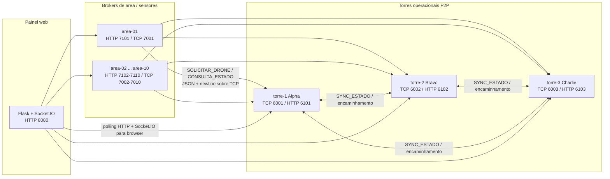
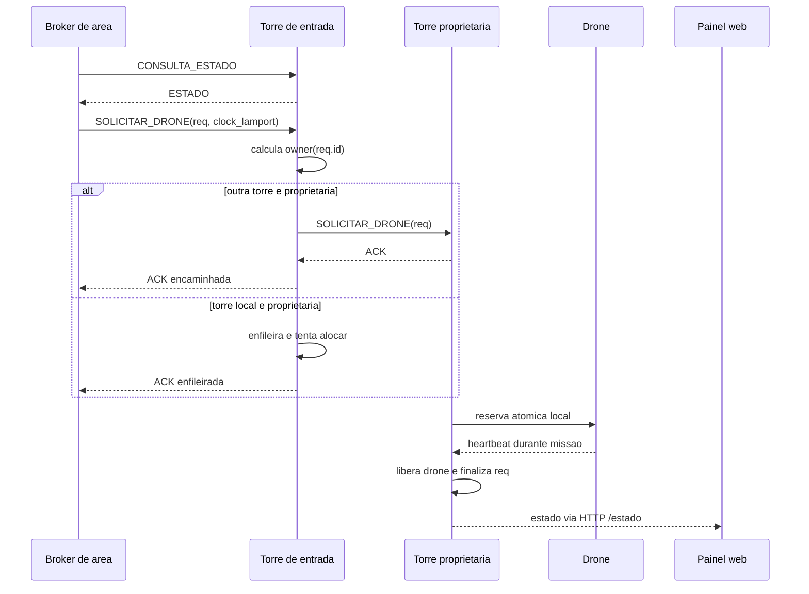
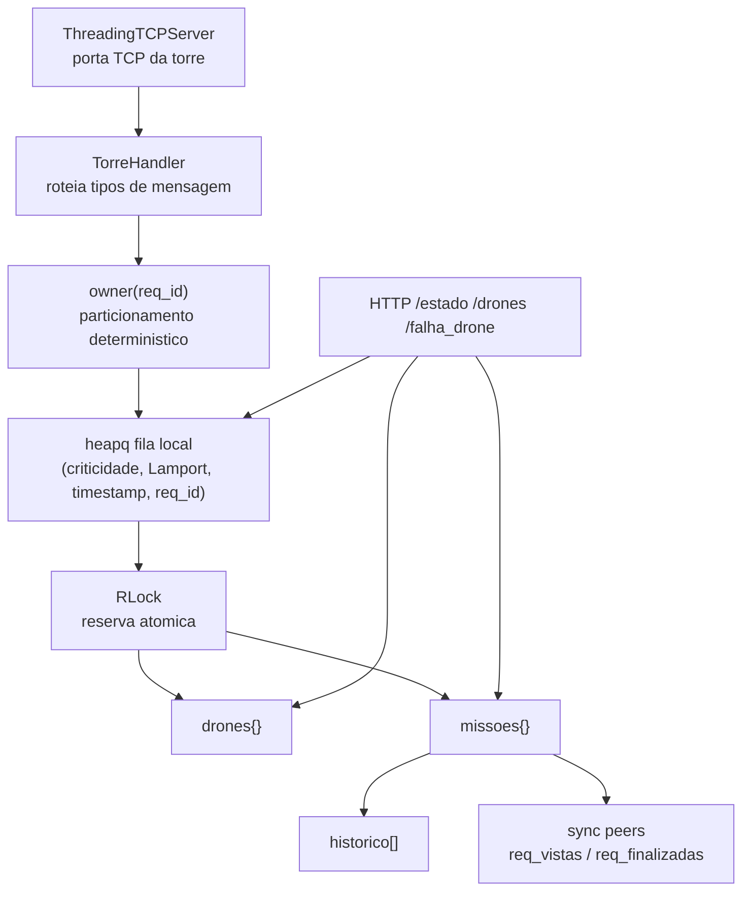

# Monitorador de Ormuz

Sistema distribuido para monitoramento simulado do Estreito de Ormuz, com setores que geram ocorrencias, torres operacionais que despacham drones e uma interface web de observabilidade e controle.

O projeto foi construido como uma arquitetura P2P sem coordenador central. Cada torre e autonoma, mantem seus drones, recebe requisicoes por TCP, replica metadados essenciais para seus pares e decide o despacho com fila de prioridade, relogio de Lamport, deduplicacao e replanejamento em caso de falha.

## Sumario

- [Visao geral](#visao-geral)
- [Arquitetura](#arquitetura)
- [Como instalar](#como-instalar)
- [Como executar](#como-executar)
- [Como usar](#como-usar)
- [Algoritmos](#algoritmos)
- [Decisoes de projeto](#decisoes-de-projeto)
- [API e portas](#api-e-portas)
- [Testes](#testes)
- [Estrutura do repositorio](#estrutura-do-repositorio)

## Visao geral

O sistema representa tres tipos de componentes:

- **Brokers de area**: simulam setores/sensores maritimos. Eles criam ocorrencias automaticamente ou sob demanda e solicitam drones as torres.
- **Torres de drones**: sao brokers operacionais autonomos. Mantem drones, fila de requisicoes, missoes ativas, historico, peers e mecanismos de falha.
- **Interface web**: consulta areas e torres por HTTP, exibe estado global e oferece operacoes de controle. Ela nao participa da decisao de despacho.

Fluxo principal:

1. Uma area detecta uma ocorrencia.
2. O broker da area consulta a carga das torres disponiveis.
3. A area envia `SOLICITAR_DRONE` por TCP.
4. A torre que recebe calcula a dona deterministica da requisicao.
5. A requisicao e encaminhada, enfileirada ou deduplicada.
6. A torre proprietaria reserva atomicamente um drone livre.
7. A missao e executada, monitorada e concluida.
8. Em caso de falha, a requisicao volta para a fila com prioridade elevada.

## Arquitetura

### Diagrama de componentes



### Diagrama de sequencia



### Arquitetura interna da torre



## Como instalar

### Pre-requisitos

- Python 3.11 ou superior.
- Docker e Docker Compose, para execucao completa em containers.
- `curl`, opcional, para testar as rotas HTTP.

### Instalacao local para testes Python

```bash
python -m venv .venv
```

Windows PowerShell:

```powershell
.\.venv\Scripts\Activate.ps1
```

Linux/macOS:

```bash
source .venv/bin/activate
```

Instale as dependencias:

```bash
pip install -r requisitos.txt
```

Execute a suite automatizada:

```bash
python -m unittest discover -s tests -v
```

### Configuracao de ambiente

O arquivo `.env` do repositorio ja vem preparado para rodar tudo em uma unica maquina com Docker Desktop:

```env
MAQUINA_TORRES_IP=host.docker.internal
MAQUINA_BROKERS_IP=host.docker.internal
MAQUINA_WEB_IP=host.docker.internal
```

Em maquinas diferentes, substitua esses valores pelos IPs reais:

```env
MAQUINA_TORRES_IP=192.168.1.10
MAQUINA_BROKERS_IP=192.168.1.20
MAQUINA_WEB_IP=192.168.1.30
```

## Como executar

### Modo recomendado: Docker em uma unica maquina

Suba as torres:

```bash
docker compose -f docker-compose.torres.yml up --build
```

Em outro terminal, suba os brokers de area:

```bash
docker compose -f docker-compose.brokers.yml up --build
```

Em outro terminal, suba a web:

```bash
docker compose -f docker-compose.web.yml up --build
```

Acesse:

```text
http://localhost:8080
```

### Modo distribuido: tres maquinas

Maquina das torres:

```bash
MAQUINA_TORRES_IP=<ip-maquina-torres> \
MAQUINA_BROKERS_IP=<ip-maquina-brokers> \
docker compose -f docker-compose.torres.yml up --build
```

Maquina dos brokers de area:

```bash
MAQUINA_TORRES_IP=<ip-maquina-torres> \
docker compose -f docker-compose.brokers.yml up --build
```

Maquina da web:

```bash
MAQUINA_TORRES_IP=<ip-maquina-torres> \
MAQUINA_BROKERS_IP=<ip-maquina-brokers> \
MAQUINA_WEB_IP=<ip-maquina-web> \
docker compose -f docker-compose.web.yml up --build
```

Acesse:

```text
http://<ip-maquina-web>:8080
```

## Como usar

### Pelo painel web

Abra `http://localhost:8080` ou `http://<ip-maquina-web>:8080`.

O painel mostra:

- torres online/offline;
- drones disponiveis ou em missao;
- fila de requisicoes;
- missoes ativas;
- historico recente;
- areas monitoradas e seus relogios de Lamport.

Operacoes disponiveis pela web:

- cadastrar ou remover drones;
- cadastrar torres adicionais;
- pausar e retomar areas;
- gerar ocorrencia manual;
- acompanhar replanejamento apos falha.

### Gerar ocorrencia manual

```bash
curl -X POST http://localhost:7101/ocorrencia_manual \
  -H "Content-Type: application/json" \
  -d '{"id":"demo-001","descricao":"Inspecao manual de rota","critica":true}'
```

### Consultar estado de uma torre

```bash
curl http://localhost:6101/estado
```

### Consultar estado global pela web

```bash
curl http://localhost:8080/api/estado
```

### Pausar uma area

```bash
curl -X POST http://localhost:7101/pausar
```

### Retomar uma area

```bash
curl -X POST http://localhost:7101/retomar
```

### Simular falha de drone

```bash
curl -X POST http://localhost:6101/falha_drone \
  -H "Content-Type: application/json" \
  -d '{"drone_id":"falcon-1a"}'
```

Resultado esperado:

- a torre remove o drone falho;
- se havia missao ativa, a requisicao volta para a fila;
- a requisicao se torna critica;
- outro drone livre e despachado automaticamente.

### Simular falha de torre

```bash
docker stop torre-2
```

Depois gere uma ocorrencia manual em qualquer area. O broker de area deve tentar torres disponiveis e a rede continua funcionando sem `torre-2`.

## Algoritmos

### 1. Escolha da torre proprietaria

Cada requisicao tem um identificador `req_id`. Todas as torres calculam a mesma proprietaria usando a soma dos bytes do ID e o numero de torres conhecidas:

```python
ids = sorted({TORRE_ID, *peers.keys()})
owner = ids[sum(req_id.encode("utf-8")) % len(ids)]
```

Esse particionamento evita uma fila central e reduz a chance de duas torres despacharem drones para a mesma requisicao. Se a proprietaria estiver indisponivel, a torre usa uma sequencia em anel a partir do owner original:

```python
idx = sum(req_id.encode("utf-8")) % len(ids)
sequencia = ids[idx:] + ids[:idx]
```

### 2. Relogio logico de Lamport

Cada componente possui um `RelogioLamport` thread-safe:

- evento local: `clock += 1`;
- antes de enviar mensagem: `clock += 1`;
- ao receber mensagem: `clock = max(clock_local, clock_remoto) + 1`.

Esse relogio nao mede tempo real. Ele estabelece ordem causal entre eventos distribuidos. A fila usa Lamport como criterio de desempate depois da criticidade.

### 3. Fila de prioridade

As requisicoes sao armazenadas em `heapq` com chave:

```python
(0 if critica else 1, clock_lamport, timestamp, req_id)
```

Prioridade efetiva:

1. ocorrencias criticas antes das normais;
2. menor clock de Lamport antes de maior clock;
3. menor timestamp fisico como desempate;
4. `req_id` como desempate estavel no heap.

### 4. Reserva atomica de drone

A torre protege `fila`, `drones`, `missoes`, `historico`, `req_vistas` e `req_finalizadas` com lock local. Ao alocar:

1. remove a requisicao da fila;
2. escolhe o melhor drone livre;
3. marca o drone como indisponivel;
4. grava `requisicao_atual`;
5. associa `drone_id` e `torre_id` na requisicao;
6. move a requisicao para `missoes`.

Esses passos acontecem dentro do lock, impedindo que duas threads locais reservem o mesmo drone.

### 5. Escolha do drone

A torre escolhe entre drones livres:

```python
min(drones_livres, key=lambda d: (d.missoes_concluidas, d.id))
```

Essa regra distribui carga por numero de missoes concluidas e usa o ID como desempate deterministico.

### 6. Deduplicacao

A torre rejeita requisicoes ja vistas, finalizadas, em missao ou ja presentes na fila:

- `req_vistas`;
- `req_finalizadas`;
- `missoes`;
- busca na `fila`.

As torres tambem sincronizam conjuntos de IDs com `SYNC_ESTADO`, reduzindo duplicatas entre peers.

### 7. Replanejamento de falha

Quando uma falha de drone e detectada por comando ou timeout de heartbeat:

1. o drone e removido;
2. a missao ativa e retirada de `missoes`;
3. a requisicao recebe status `replanejada`;
4. a criticidade e elevada para `True`;
5. o clock de Lamport avanca;
6. a requisicao volta para a fila;
7. a torre tenta alocar outro drone.

### 8. Framing TCP

As mensagens usam JSON delimitado por newline:

```json
{"tipo":"SOLICITAR_DRONE","payload":{},"clock_lamport":1,"remetente":"area-01","wall_time":...}
```

O delimitador `\n` permite que o receptor separe mensagens mesmo quando o TCP entrega dados fragmentados ou agrupados.

## Decisoes de projeto

### Sem coordenador central

O sistema evita uma fila unica, banco central ou master. Isso aumenta a tolerancia a falhas: se uma torre cai, as demais continuam aceitando ocorrencias e despachando drones.

### TCP para operacao critica

As comunicacoes entre areas e torres usam TCP porque o projeto precisa de entrega ordenada e confiavel entre processos. A aplicacao ainda implementa ACK, timeout e retentativa para lidar com falhas de processo ou rede.

### HTTP apenas para observabilidade e controle

As portas HTTP existem para dashboard e operacoes administrativas. A decisao operacional de despacho continua no caminho TCP, onde trafegam as mensagens com Lamport.

### Lamport em vez de relogio fisico

Relogios fisicos entre maquinas podem divergir. Lamport preserva relacoes causais entre mensagens sem depender de sincronizacao de horario.

### Particionamento deterministico por requisicao

O owner por hash simples de `req_id` distribui trabalho e faz todas as torres convergirem para a mesma responsavel por uma requisicao.

### Estado replicado minimo

As torres sincronizam IDs vistos e finalizados, nao o estado completo de todas as filas. Isso reduz acoplamento e trafego, mantendo o suficiente para deduplicacao distribuida.

### Simulacao com falhas observaveis

O sistema foi desenhado para demonstrar comportamento distribuido: timeout, encaminhamento, deduplicacao, prioridade, heartbeat, falha de drone e replanejamento automatico.

## API e portas

### Torres

| Torre | TCP | HTTP | Drones iniciais |
|---|---:|---:|---|
| torre-1 Alpha | 6001 | 6101 | falcon-1a, falcon-1b |
| torre-2 Bravo | 6002 | 6102 | falcon-2a, falcon-2b |
| torre-3 Charlie | 6003 | 6103 | falcon-3a, falcon-3b |

Rotas HTTP das torres:

| Metodo | Rota | Uso |
|---|---|---|
| GET | `/estado` | Snapshot da torre |
| GET | `/health` | Saude basica |
| POST | `/drones` | Cadastra drone |
| POST | `/drones/<id>/delete` | Remove drone |
| POST | `/torres` | Cadastra peer |
| POST | `/falha_drone` | Simula falha |
| POST | `/liberar_drone` | Libera drone manualmente |

Mensagens TCP das torres:

| Tipo | Funcao |
|---|---|
| `SOLICITAR_DRONE` / `REQUISICAO` | Recebe requisicao de area ou peer |
| `CONFIRMAR_DESPACHO` | Confirma drone associado |
| `LIBERAR_DRONE` / `MISSAO_CONCLUIDA` | Finaliza missao |
| `FALHA_DRONE` | Remove drone e replaneja |
| `HEARTBEAT_DRONE` | Atualiza heartbeat |
| `CONSULTA_ESTADO` | Retorna snapshot via TCP |
| `SYNC_ESTADO` | Sincroniza IDs vistos/finalizados |
| `CADASTRAR_DRONE` | Cadastra drone via TCP |
| `REMOVER_DRONE` | Remove drone via TCP |
| `CADASTRAR_TORRE` | Cadastra peer via TCP |

### Areas

| Areas | TCP | HTTP |
|---|---:|---:|
| area-01 a area-10 | 7001 a 7010 | 7101 a 7110 |

Rotas HTTP das areas:

| Metodo | Rota | Uso |
|---|---|---|
| GET | `/status` | Estado da area |
| GET | `/health` | Saude basica |
| POST | `/pausar` | Pausa geracao automatica |
| POST | `/retomar` | Retoma geracao automatica |
| POST | `/intervalo` | Altera intervalo de ocorrencias |
| POST | `/ocorrencia_manual` | Gera requisicao manual |

### Web

| Servico | Porta | Rotas principais |
|---|---:|---|
| Flask + Socket.IO | 8080 | `/`, `/api/estado`, `/api/torres`, `/api/drones`, `/api/areas` |

## Testes

Execute:

```bash
python -m unittest discover -s tests -v
```

A suite atual cobre:

- concorrencia e deduplicacao de requisicao;
- prioridade de criticidade sobre ordem de chegada;
- replanejamento apos falha de drone.

Tambem ha um roteiro manual em [`docs/TESTE_FALHA.md`](docs/TESTE_FALHA.md) com cenarios de falha de broker operacional e falha de drone.

## Estrutura do repositorio

```text
.
├── brokers/
│   ├── broker_base.py        # Logica comum dos brokers de area
│   └── area_01.py ...        # Entrypoints das 10 areas
├── torres/
│   └── torre.py              # Broker operacional de drones
├── shared/
│   ├── config.py             # Portas, IPs, coordenadas e ocorrencias
│   ├── lamport.py            # Relogio de Lamport e framing TCP
│   └── models.py             # Dataclasses Requisicao e Drone
├── web/
│   ├── app.py                # API web e agregacao de estado
│   └── templates/index.html  # Dashboard
├── tests/
│   └── test_dispatch.py      # Testes unitarios do despacho
├── docs/
│   ├── ARQUITETURA.md
│   └── TESTE_FALHA.md
├── docker-compose.torres.yml
├── docker-compose.brokers.yml
├── docker-compose.web.yml
├── requisitos.txt
└── README.md
```

## Estado esperado em execucao

Com todos os containers ativos, o sistema deve apresentar:

- 3 torres online;
- 10 areas online;
- 6 drones iniciais;
- ocorrencias sendo geradas periodicamente;
- clocks de Lamport aumentando conforme mensagens circulam;
- missoes entrando e saindo da fila;
- historico de requisicoes concluidas.

## Referencias internas

- Arquitetura detalhada: [`docs/ARQUITETURA.md`](docs/ARQUITETURA.md)
- Testes de falha: [`docs/TESTE_FALHA.md`](docs/TESTE_FALHA.md)
- Implementacao das torres: [`torres/torre.py`](torres/torre.py)
- Implementacao das areas: [`brokers/broker_base.py`](brokers/broker_base.py)
- Protocolo Lamport/TCP: [`shared/lamport.py`](shared/lamport.py)
